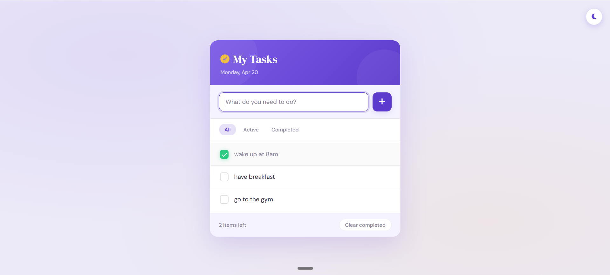
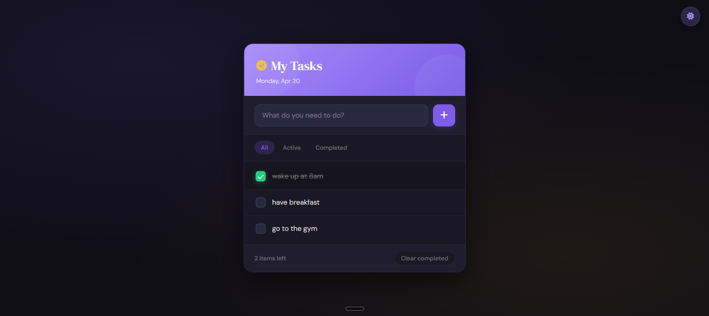

# 📝 To-Do List Web App

A clean and minimal **To-Do List application** built using **HTML, CSS, and JavaScript** with support for both **Light Mode 🌞** and **Dark Mode 🌙**.

---

## 🚀 Overview

This project is a simple yet effective task manager that helps users stay organized and productive. It focuses on core JavaScript concepts like **DOM manipulation** and **event handling**, while delivering a modern and responsive UI.

---

## ✨ Features

* ➕ Add tasks instantly
* ✅ Mark tasks as completed
* ❌ Delete tasks
* 🌗 Toggle between Light Mode & Dark Mode
* 🔄 Real-time UI updates
* 🎯 Clean and user-friendly interface

---

## 🛠️ Tech Stack

* **HTML** – Structure
* **CSS** – Styling (Light/Dark themes)
* **JavaScript** – Functionality

---

## 📂 Project Structure

```
To-Do-App/
│
├── index.html
├── style.css
├── script.js
└── final-look/
    ├── light-mode.png
    └── Dark-Mode.png
```

---

## ⚙️ How to Run the Project

1. Clone the repository:

```
git clone <your-repo-link>
```

2. Open the folder:

```
cd To-Do-App
```

3. Run the project:

* Open `index.html` in your browser

---

## 📸 Screenshots

### 🌞 Light Mode

<p align="center">
  
</p>

---

### 🌙 Dark Mode

<p align="center">
  
</p>

---

## 🎯 Learning Outcomes

Through this project, I learned:

* DOM Manipulation
* Event Handling
* Dynamic UI Updates
* Theme Switching (Light/Dark Mode)

---

## 🔮 Future Improvements

* 💾 Add Local Storage to save tasks
* 📅 Add due dates and reminders
* 🔍 Task filtering (All / Completed / Pending)
* 🎨 Improve UI with animations

---

## 🤝 Contributing

Contributions are welcome! Feel free to fork this repository and submit a pull request.

---

## 👨‍💻 Author

**Rajbir Singh**

---

⭐ If you like this project, consider giving it a star!
